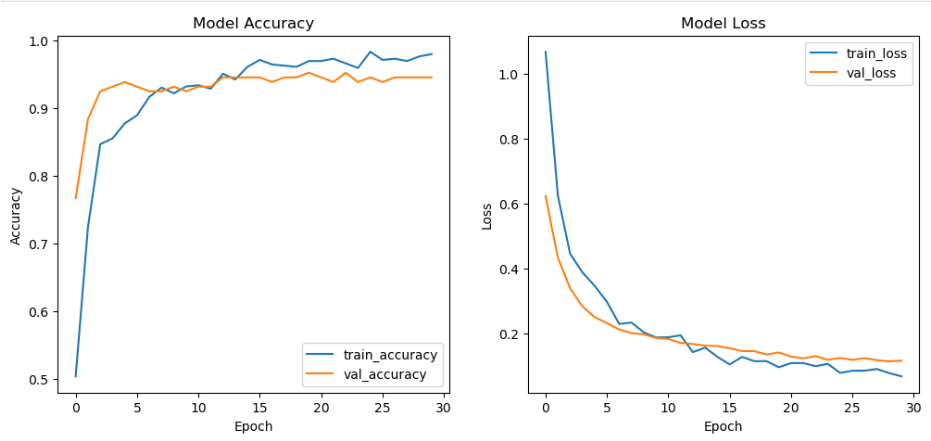

# SnapHeal– Skin Health Prototype

This project is a prototype of our *AI-powered student wellness platform, starting with a focus on skin health. The current version has been trained on a **small dataset* with three categories:

* Clear Skin
* Ringworm
* Acne

We showcase accuracy results, performance graphs, and the user interface to demonstrate feasibility.

## 🔍 Current Prototype

* Image upload → Prediction (Clear / Ringworm / Acne)
* Shows result with confidence score
* Simple, student-friendly UI

## 📊 Results & Screenshots

## HOME PAGE

## UPLOAD PAGE

## IMAGE ADDED

## OUTPUT

## MODEL ACCURACY CURRENTLY (Trained on 3 datasets - 400+ images)

## 🌱 Future Expansion

* Train on larger, more diverse skin datasets
* Add features like diet recommendations, mental health page, and doctor booking
* Improve accuracy and robustness with multimodal input (images + symptoms)
* Scale into a unified student wellness platform across the country

## ⚠ Note

This prototype is only for demonstration and research purposes. It is *not a substitute for medical diagnosis*.

🩺 Supported Conditions: Currently, the model is trained to classify only three categories:

*Acne*

*Ringworm*

*Normal Skin*

📷 Best Results: For accurate predictions, please upload a clear image of the affected skin area only rather than a full-body or unrelated photo.

❌ Images outside these categories may lead to incorrect predictions.
